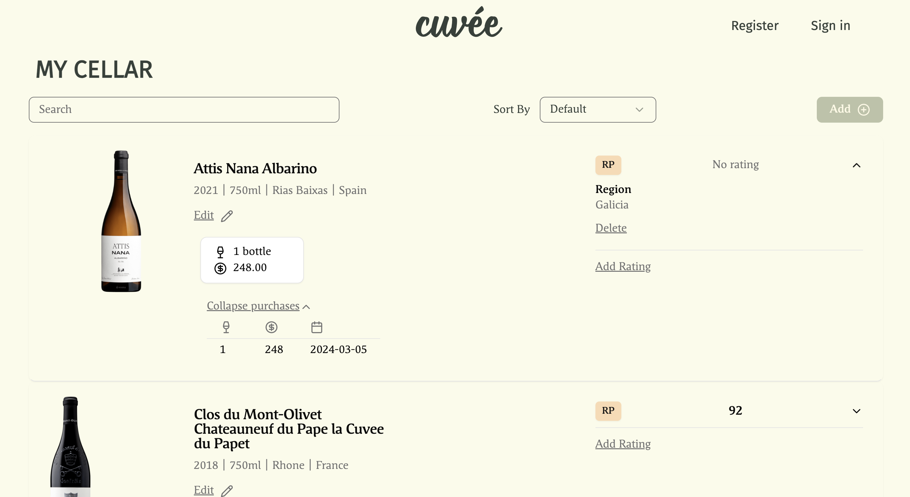
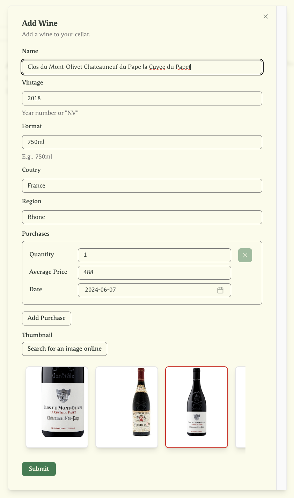
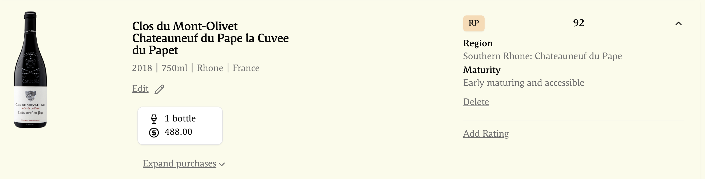
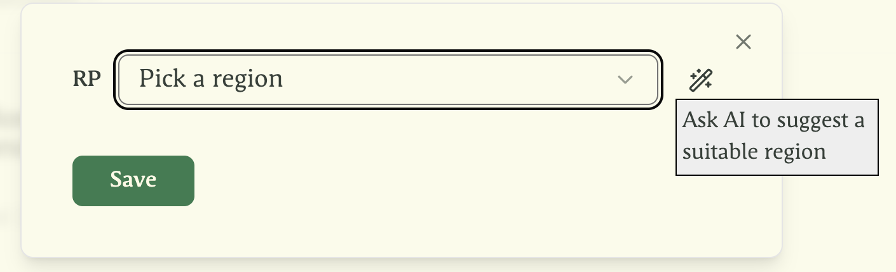

# cuvee

A simple web application for managing wine cellars.

This is my learing project for Go and Svelte. Currently it is a desktop-only web app.

## Features

<b>View all your wines and purchases</b>



<b>Add a new wine</b>

Click "Search for an image online" to add a picture of the wine.



<b>Search by name, vintage, country or region</b>


<b>View the vintage chart of a given region</b>



<b>Ask AI to suggest a suitable vintage chart region</b>




## Run

#### Backend

First, you should create a `.env` file in the `backend` directory.

Then, you can run the backend with [air](https://github.com/air-verse/air).

```shell
cd backend
go mod download
air
```

#### Frontend

```shell
cd frontend
npm i
npm run dev
```
